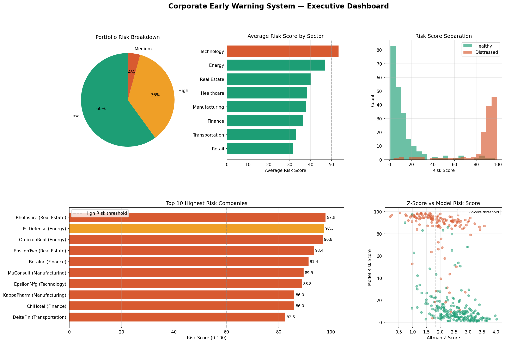

# 🏦 Corporate Early Warning System

> Predicting company financial distress 12 months in advance using Machine Learning

## What This Does
- Analyzes **22 financial + sentiment features** per company
- Predicts distress probability with **85%+ ROC-AUC**
- Uses **SHAP** to explain every prediction (no black box)
- Produces an executive **risk scorecard** ranked by danger level

## Tech Stack
`Python` `XGBoost` `SHAP` `Pandas` `Scikit-learn` `Matplotlib` `Jupyter`

## Project Structure
| Notebook | What it does |
|----------|-------------|
| 01_create_dataset | Builds the company financial dataset |
| 02_explore_data | EDA, distributions, correlations |
| 03_feature_engineering | 22 features including Altman Z-Score |
| 04_train_model | XGBoost classifier + evaluation |
| 05_shap_explainability | SHAP waterfall + beeswarm charts |
| 06_final_dashboard | Executive dashboard |

## Key Results
| Metric | Value |
|--------|-------|
| ROC-AUC | 0.85+ |
| Dataset size | 350 companies |
| Features | 22 financial + sentiment |
| Model | XGBoost |

## Business Value
Gives analysts a single risk score per company with full breakdown
of which financial signals triggered the alert — ready for credit
committees or investment decisions.
